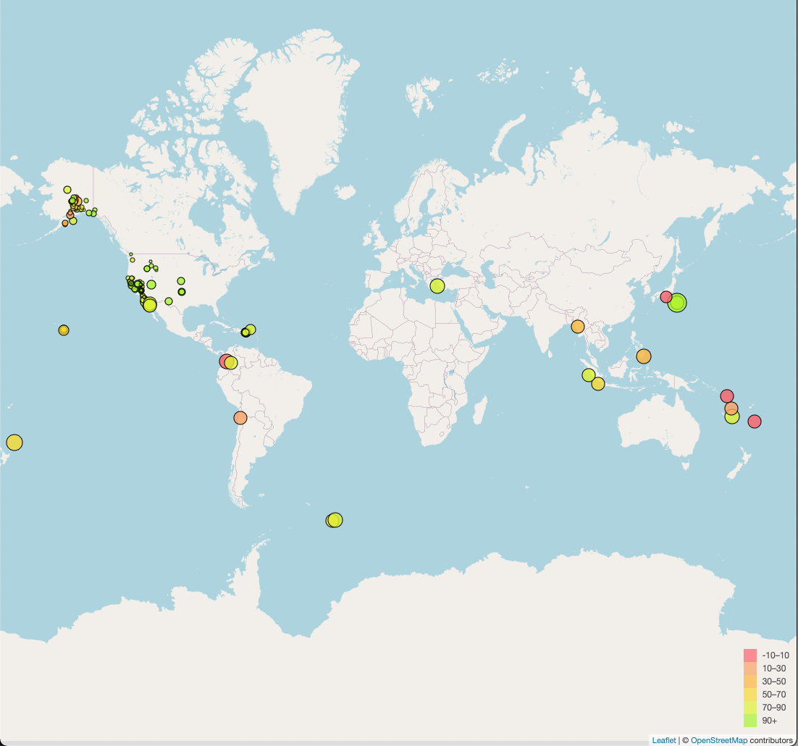

# leaflet-challenge

In this project,
data from [the USGS GeoJSON Feed](https://earthquake.usgs.gov/earthquakes/feed/v1.0/geojson.php) for all earthquakes in the past day was used to create a map using Leaflet. The maps shows circle markers for each earthquake, based on their longitude and latitude. Each marker shows the magnitude and depth of the earthqueske. Below is the visual generated. 

